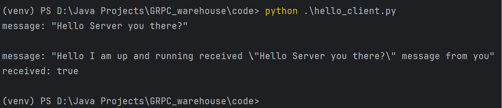

# GRPC Warehouse

**Author**: Benjamin Princ

**Date**: 20.02.2024

- [GRPC Warehouse](#grpc-warehouse)
  - [Introduction](#introduction)
  - [Theory questions](#theory-questions)
  - [Work (GKue)](#work-gkue)
    - [1. Installing python packages](#1-installing-python-packages)
    - [2. Defining the .proto file](#2-defining-the-proto-file)
    - [3. Client and Server](#3-client-and-server)
  - [Work (GKv)](#work-gkv)
    - [1. Create a new gradle Project](#1-create-a-new-gradle-project)
    - [2. Generating the grpc classes from the .proto file](#2-generating-the-grpc-classes-from-the-proto-file)
      - [2.1 Problem with generated classes](#21-problem-with-generated-classes)
    - [3. Implementing the method to answer the grpc request](#3-implementing-the-method-to-answer-the-grpc-request)
    - [4. Implementing the python client](#4-implementing-the-python-client)
  - [Work (EKv)](#work-ekv)
    - [Changing the proto file](#changing-the-proto-file)
    - [Adding the code to the server](#adding-the-code-to-the-server)
    - [Adding the code to the client](#adding-the-code-to-the-client)
  - [Sources](#sources)


## Introduction
A grpc demo should be implemented, which shows the communication between a server and client.

## Theory questions 

*What is gRPC and why does it work accross languages and platforms?*
* A RPC(Remote Procedure Call) Framework, makes it possible to call methods on an other device. gRPC uses Protocol Buffers for serialization and HTTP2 for transportation.

*Describe the RPC life cycle starting with the RPC client?*
* The client sends a Proto Request to the gRPC server, which then answers with a Proto Response. The Request and Response methods are declared in the .proto file, which is essential.

*Describe the workflow of Protocol Buffers?*
* Protocol Buffers are language- and platform-neutral, and are used for serzializing structured data. From the .proto file language-specific code can be generated.

*What are the benefits of using protocol buffers?*
* Protocol buffers are high performant and enable a seamless integration between different services.

*When is the use of protocol not recommended?*
* When you use a non-object-oriented language

*List 3 different data types that can be used with protocol buffers*
* Primitive data types (boolean, integers, floats), message (used for nested or repeating parts), enums (A set of values to choose from)

## Work (GKue)

### 1. Installing python packages
GRPC needs the packages **grpcio** and **grpcio-tools**, which can be installed with `pip install grpcio grpcio-tools`.

### 2. Defining the .proto file
You can say, that the proto file defines the grpc service. For example, which datatypes are used. After the proto file is finished, a command generate the stubs, which are essential for the client and server.

`python -m grpc_tools.protoc --proto_path=. ./<FileName>.proto --python_out=. --grpc_python_out=.`


### 3. Client and Server
* **Server:**
In my case, the [Server](code/gkue/hello_server.py) serves a service on the localhost port 50051 and also defines what happens when the client requests the server.

* **Client:**
The [Client](code/gkue/hello_client.py) is the client which requests the localhost port 50051 and sends a message to it.

In my case the Server then answers the client reponse whith a message, which contains the clients text and something else.




## Work (GKv)

### 1. Create a new gradle Project
For the grpc java implementation i created a new gradle project, which contains the old java class for creating random Products.
The .proto file declares the Warehouse and ProductData(which is part of the warehouse)

### 2. Generating the grpc classes from the .proto file
Google´s protobuf plugin is able to automatically generate the needed classes from the .proto file, when gradle builds the project.

#### 2.1 Problem with generated classes
At first i got a syntax error when i tried to access the generated classes. 
With the help of the stackoverflow thread (Source [4]), i found out, that you need to declare the generated path as source for the IDE:
```gradle
sourceSets {
    main {
        java {
            srcDirs 'build/generated/source/proto/main/grpc'
            srcDirs 'build/generated/source/proto/main/java'
        }
    }
}
```
*build.gradle*

### 3. Implementing the method to answer the grpc request 
My WarehouseImpl class is responsible for answering requests to the server.
When it gets a new request, it generates three randomProducts, fills out the WarehouseData.builder and adds the products to it.

In the main method a simple server on port 50051 gets created and the Impl class gets add as a service.

```java
public class Main {
    public static void main(String[] args) throws Exception {
        Server server = ServerBuilder.forPort(50051)
                .addService(new WarehouseImpl())
                .build()
                .start();

        System.out.println("Server started, listening on " + 50051);

        server.awaitTermination();
    }
}
```

### 4. Implementing the python client
For the python client, i simply copied the same proto file like for the server,
into my python project and entered the command:

`python -m grpc_tools.protoc --proto_path=. ./warehouse.proto --python_out=. --grpc_python_out=.`

```py
def run():
    channel = grpc.insecure_channel('localhost:50051')
    stub = warehouse_pb2_grpc.WarehouseStub(channel)

    request = warehouse_pb2.MessageResponse()

    response = stub.GetServerResponse(request)

    print("Client received: " + response.responseData)
    print(locale.getpreferredencoding())

if __name__ == '__main__':
    run()
```

## Work (EKv)
A health ping system should be implemented.

### Changing the proto file
```proto
syntax = 'proto3';

option java_package = "io.grpc.warehouse";
package warehouse;

service Warehouse{
  //https://www.velotio.com/engineering-blog/grpc-implementation-using-python
  rpc GetServerResponse(WarehouseData) returns (MessageResponse) {}

  rpc HealthCheck(PingRequest) returns (PingResponse) {}
}

message ProductData {
  string productID = 1;
  string productName = 2;
  string productCategory = 3;
  int32 productQuantity = 4;
  string productUnit = 5;
}

message WarehouseData {
  string warehouseID = 1;
  string warehouseName = 2;
  string timestamp = 3;
  string warehouseAddress = 4;
  int32 warehousePostalCode = 5;
  string warehouseCity = 6;
  string warehouseCountry = 7;
  repeated ProductData productData = 8;  // Use 'repeated' for arrays/lists.
}

message MessageResponse{
  string responseData = 1;
}

message PingRequest {
  string clientID = 1;
}

message PingResponse {
  string clientID = 1;
  string timestamp = 2;
  string status = 3;
}
```
The new proto file has a PingRequest and PingResponse which is for the health check system.

### Adding the code to the server
The server has a healtCheck response method and a Scheduler, which looks every 5 seconds, if the client send a ping again.
Otherwise it logs an error

```java
private static final Logger logger = Logger.getLogger("HealthCheck");
private final ConcurrentHashMap<String, Long> lastHealthCheck = new ConcurrentHashMap<>();
private final ScheduledExecutorService scheduler = Executors.newScheduledThreadPool(1);

public WarehouseImpl() {
        scheduler.scheduleAtFixedRate(() -> {
            long now = System.currentTimeMillis();
            lastHealthCheck.forEach((clientID, lastCheckTime) -> {
                if (now - lastCheckTime > 5000) {
                    logger.warning("Client " + clientID + " has no response.");
                }
            }
        }
}


WarehouseOuterClass.PingResponse response = WarehouseOuterClass.PingResponse.newBuilder()
                .setClientID(request.getClientID())
                .setTimestamp(new SimpleDateFormat("yyyy-MM-dd HH:mm:ss.SSS").format(new Date()))
                .setStatus("healthy")
                .build();

        responseObserver.onNext(response);
        responseObserver.onCompleted();
        lastHealthCheck.put(request.getClientID(), System.currentTimeMillis());
```

### Adding the code to the client
The client has a while-true loop, which sends a ping to the server every 5 seconds. It receives a "healthy"-response and the timestamp from the server.

## Sources
[1], *GRPC Introduction*, https://grpc.io/docs/what-is-grpc/introduction/

[2], *GRPC python*, https://www.velotio.com/engineering-blog/grpc-implementation-using-python

[3], *Java proto*, https://medium.com/@DivyaJaisawal/generate-java-code-from-proto-file-using-gradle-1fb9fe64e046

[4], *Import generated fiels*, https://stackoverflow.com/questions/44088009/import-protobuf-generated-classes-using-gradle-in-intellij

[5], *Protocol Buffer*, https://protobuf.dev/overview/

[6], *concurrent Hashmap*, https://www.baeldung.com/java-concurrent-map 
